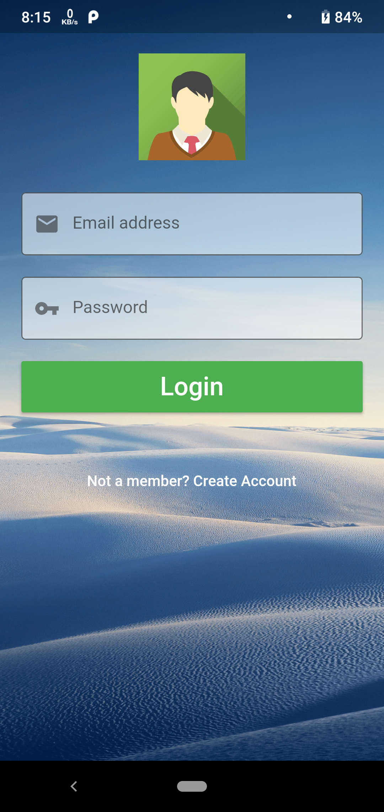
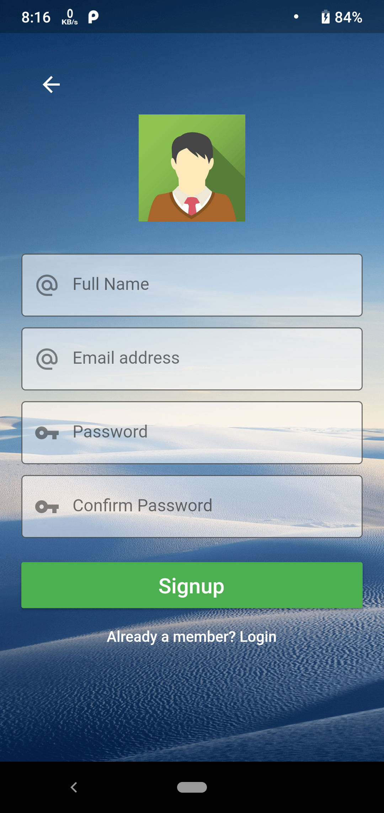
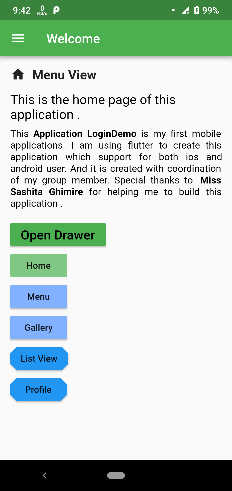
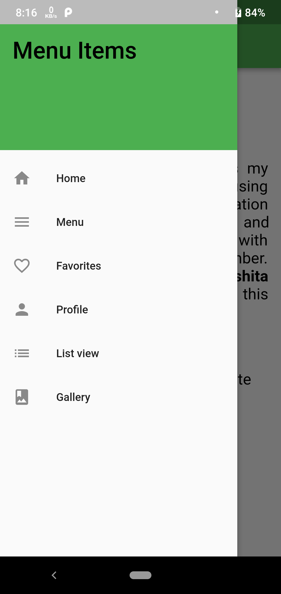
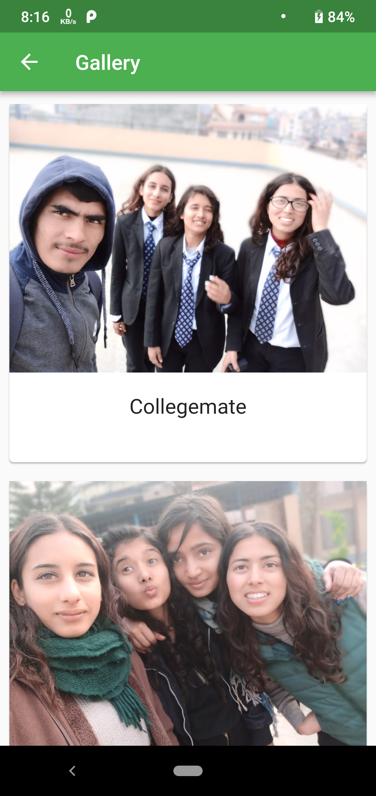
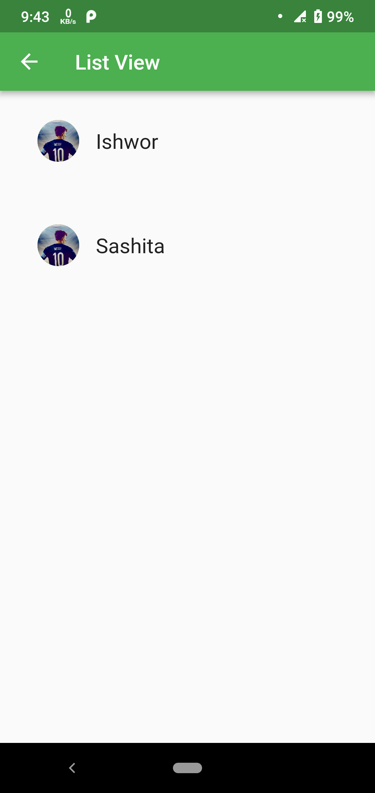

# demologin

A new Flutter project.

## Getting Started

This project is a starting point for a Flutter application.

These are some Screenshot of this application.

<!-- 

 -->

 

 

<!--  -->